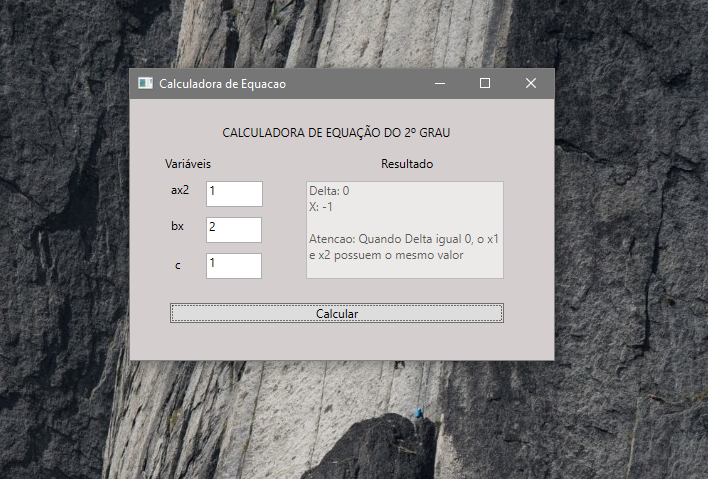
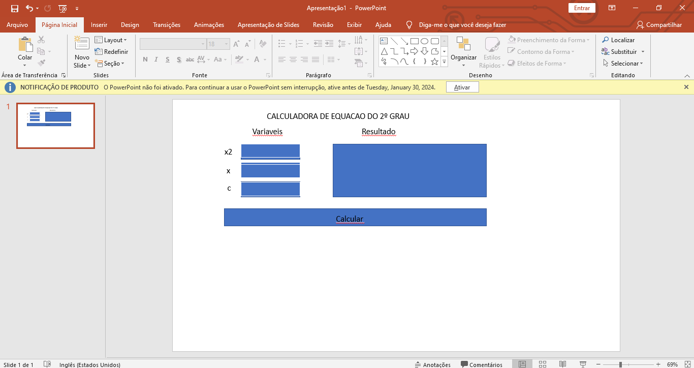

# Calculator of Second degree Equation

Calculator of Second degree Equation is an applicative to educations focus that help everyone test exercise to simple shape.

## How do you use ?

To use the Calculator of Second Degree Equation is very simple, are three variables essential (a, b, c) that canonical form are ax2 + bx + c = 0
Enter a number a, b, c based this canonical form and show picture below

## How do you think?

I'm not UI/UX or Design Expert, so I had a ideia and draw to simple way using Microsoft Power Point to develope my app

## More

Watch youtube: https://youtu.be/qyFoXg79kX0?si=6dmQxjoez2TNs3bL
Download:  https://drive.google.com/file/d/13_pHexpkZdSlpgH8gWGfn47nnn_REjsn/view
